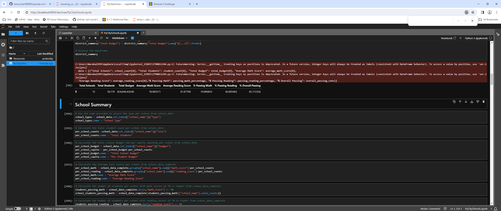

### Pandas-Challenge: PyCitySchool
## Summary
1. District Summary

2. School Summary
![alt text] ()
3. Highest Performing Schools by Percentage of Overall Passing
![alt text] ()
4. Loest Preforming Schools by Percentage of Overall Passing
![alt text] ()
5. Math Scores by Grade
![alt text] ()
6. Reading Scores by Grade
![alt text] ()
7. Scores by School Spending
![alt text] ()
8. Scores by School Size
![alt text] ()
9. Scores by School Type
![alt text] ()
## Conclusion
